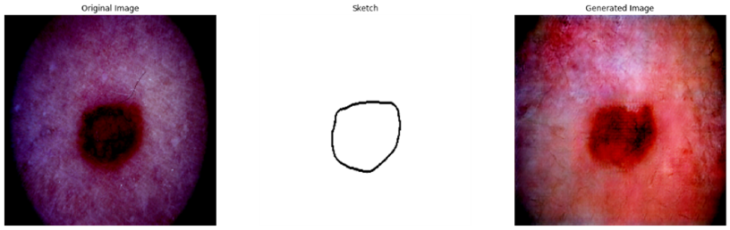

# Dermoscopic Lesion Image Generation using Conditional GANs

This project aims to generate dermoscopic lesion images using Conditional Generative Adversarial Networks (cGANs) and evaluate the generated images with a classifier model. The project explores three different architectures for cGANs and presents the results obtained through training on multiple epochs.

## Table of Contents
- [Methodology](#methodology)
  - [Architecture 1](#architecture-1)
  - [Architecture 2](#architecture-2)
  - [Architecture 3](#architecture-3)
  - [Loss and Score Functions](#loss-and-score-functions)
  - [Classifier](#classifier)
- [Results](#results)
  - [Architecture 1 Results](#architecture-1-results)
  - [Architecture 2 Results](#architecture-2-results)
  - [Architecture 3 Results](#architecture-3-results)
- [Discussion and Conclusion](#discussion-and-conclusion)
- [Acknowledgments](#acknowledgments)

## Methodology

The generation of dermoscopic lesion images was achieved using conditional GANs with the following three architectures:

### Architecture 1
- Uses random images concatenated with labels as input to the Generator.
- Discriminator distinguishes between real and generated images by concatenating each with the labels.

### Architecture 2
- Uses paired sketches with labels as input to the Generator.
- The generated and real images are concatenated with labels and passed to the Discriminator for classification.

### Architecture 3
- Implements pixel-to-pixel image translation.
- Sketches are fed as conditions to the Generator, and the Discriminator classifies the generated and real images.

### Loss and Score Functions
- **Binary Cross-Entropy** and **L1 Loss** are used for training.
- Evaluation metrics include **Frechet Inception Distance (FID)** and **Inception Score (IS)**.

### Classifier
A classifier model was trained to classify real and generated images, achieving different accuracies on each dataset.

## Results

The results below summarize the model performance for each architecture in terms of training losses and visual outputs.

### Architecture 1 Results
- **Epochs Trained:** 50
- **Discriminator Loss:** Stabilized around 0.5
- **Generator Loss:** Improved over training epochs
- **Generated Samples:** 
||
||
||

### Architecture 2 Results
- **Epochs Trained:** 100
- **Discriminator Loss:** Optimized around 0.5 in the final iterations
- **Generator Loss:** Reduced to approximately 3
- **Generated Samples:** 
||
||
||

### Architecture 3 Results
- **Epochs Trained:** 1200
- **Discriminator Loss:** Optimized in later epochs
- **Generator Loss:** Reached approximately 12
- **Generated Samples:** 
||
||
||

### Evaluation Scores
| Architecture   | FID   | IS   |
|----------------|-------|------|
| Architecture 1 | 32.67 | 5.27 |
| Architecture 2 | 0.22  | 16.35 |
| Architecture 3 | 0.34  | 11.23 |

## Discussion and Conclusion
This project demonstrated the effectiveness of various cGAN architectures for generating realistic dermoscopic images. The training of three distinct architectures provided insights into different ways to condition GANs and their effects on output quality. A classification model was also trained, achieving a testing accuracy of 60% and a 56% accuracy on generated images.

